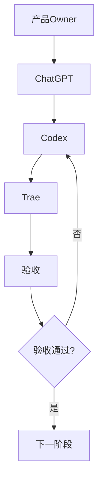
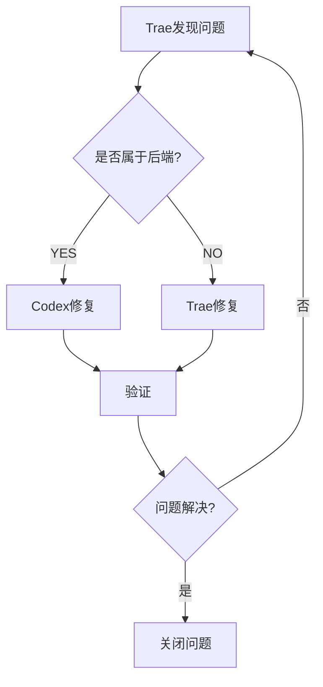
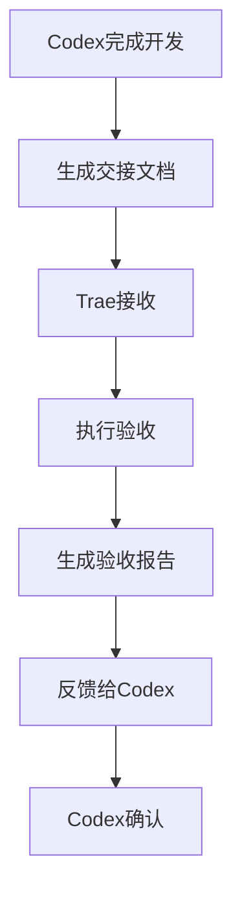

# AI协同工作流程

## 版本

PGF v2.0

## 主工作流程

### 流程说明

1. **产品Owner**：提出需求和目标
2. **ChatGPT（AI Technical Director）**：规划任务、审核方案、分配资源
3. **Codex**：开发后端业务逻辑、API接口、数据库迁移
4. **Trae**：前端开发、浏览器验收、权限测试
5. **验收**：验证功能正确性、数据完整性、权限有效性
6. **下一阶段**：验收通过后进入下一阶段

## 问题反馈流程

### 流程说明

1. **Trae发现问题**：在验收过程中发现问题
2. **判断问题类型**：确定问题属于后端还是前端
3. **分配修复**：后端问题分配给Codex，前端问题分配给Trae
4. **验证**：修复后进行验证
5. **关闭问题**：验证通过后关闭问题

## 任务交接流程

### 流程说明

1. **Codex完成开发**：完成后端开发任务
2. **生成交接文档**：使用HANDOFF_TEMPLATE生成交接文档
3. **Trae接收**：Trae接收交接文档
4. **执行验收**：Trae执行验收测试
5. **生成验收报告**：Trae生成验收报告
6. **反馈给Codex**：Trae将验收结果反馈给Codex
7. **Codex确认**：Codex确认验收结果

## 多Agent协同规则

### 通信规则

1. 使用统一的交接模板
2. 明确任务边界和修改范围
3. 及时反馈问题和进展
4. 保持沟通简洁明了

### 协作规则

1. 遵循PGF v2.0治理框架
2. 遵守阶段推进原则，不得跳阶段
3. 遵守数据库保护规则
4. 遵守修改范围规则

### 冲突解决规则

1. 优先参考PROJECT_MEMORY中的历史决策
2. 参考DECISION_LOG中的相关决策
3. 由ChatGPT（AI Technical Director）裁决
4. 将裁决记录到DECISION_LOG