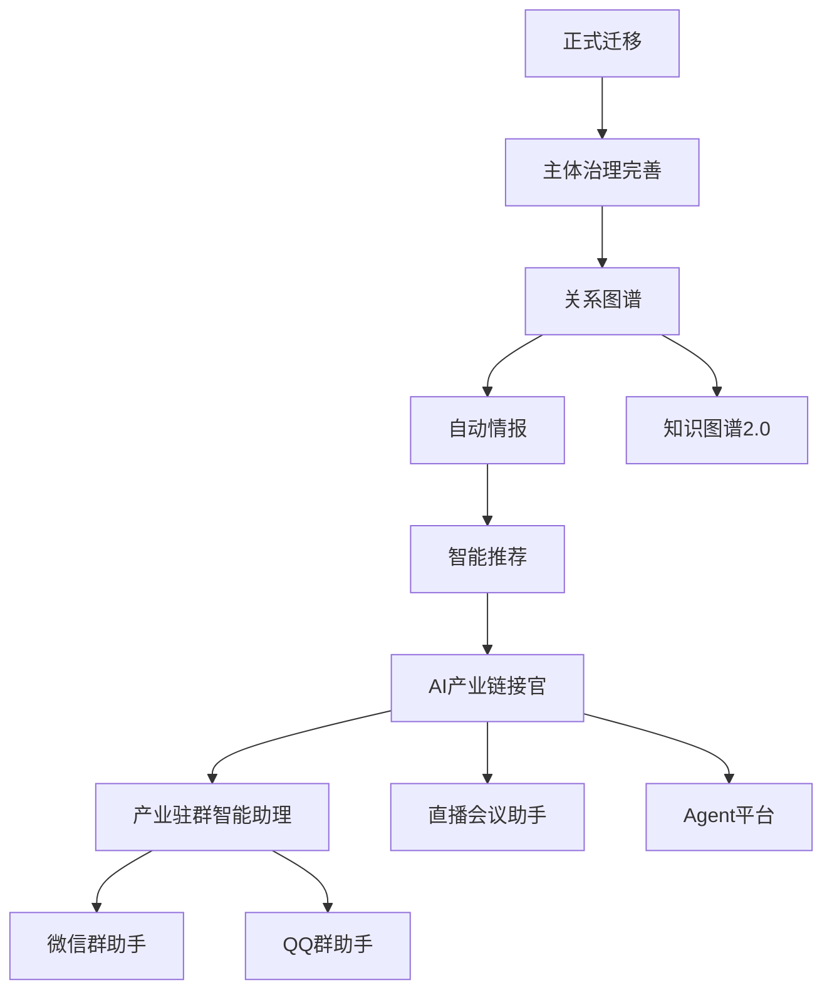

# 未来模块规划

> 当前执行顺序唯一来源：`../PROJECT_EXECUTION_ROADMAP.md`。本文件保留为历史背景，不再定义当前阶段顺序。

## 版本

PGF v2.0

## 标记说明

所有未来模块统一标记为 **Future**，禁止提前开发。

## 未来模块列表

### AI产业链接官

**描述**：AI驱动的产业链接官，自动发现和匹配合作机会。

**状态**：Future

**依赖**：主体治理完善、关系图谱

### 产业驻群智能助理

**描述**：驻留在产业社群中的智能助理，提供实时情报和对接服务。

**状态**：Future

**依赖**：AI产业链接官

### 微信群助手

**描述**：微信群智能助手，自动收集群内信息，识别商机。

**状态**：Future

**依赖**：产业驻群智能助理

### QQ群助手

**描述**：QQ群智能助手，自动收集群内信息，识别商机。

**状态**：Future

**依赖**：微信群助手

### 直播会议助手

**描述**：直播和会议智能助手，自动记录会议内容，生成纪要。

**状态**：Future

**依赖**：AI产业链接官

### Agent平台

**描述**：可扩展的Agent平台，支持自定义Agent开发和部署。

**状态**：Future

**依赖**：AI产业链接官、智能推荐

### 知识图谱2.0

**描述**：升级的知识图谱，支持更复杂的关系分析和推理。

**状态**：Future

**依赖**：关系图谱

### 智能推荐

**描述**：基于机器学习的智能推荐系统，推荐合作机会和资源。

**状态**：Future

**依赖**：主体治理完善、关系图谱

### 自动情报

**描述**：自动化的情报收集和处理系统。

**状态**：Future

**依赖**：正式迁移、主体治理完善

## 开发顺序

## 禁止提前开发

所有Future标记的模块必须在其依赖模块完成后才能开发。

**禁止**：
- 跳过依赖模块直接开发Future模块
- 在当前阶段开发Future模块
- 为Future模块编写业务代码

**允许**：
- 为Future模块编写设计文档
- 记录Future模块的需求
- 在DECISION_LOG中记录相关决策