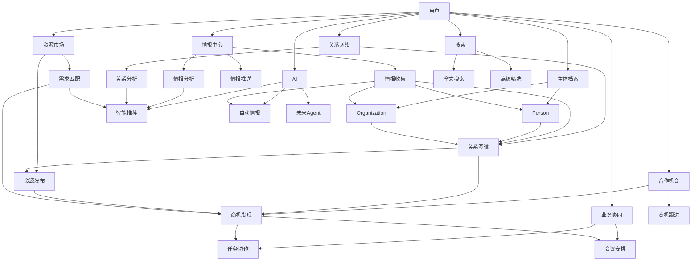
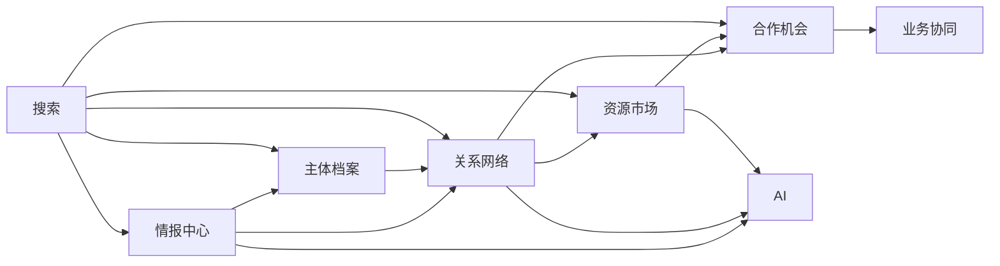

# 项目架构

## 版本

PGF v2.0

## 架构流程图

## 模块职责

### 1. 情报中心

负责产业情报的收集、整理、分析和推送。

- **情报收集**：从各种渠道收集产业动态、政策法规、技术进展等信息
- **情报分析**：对收集的情报进行分析、分类、标记
- **情报推送**：根据用户需求推送相关情报

### 2. 主体档案

管理机构和人物的完整档案信息。

- **Person**：人物档案，包括基本信息、职务、能力标签等
- **Organization**：机构档案，包括基本信息、类型、行业赛道等

### 3. 关系网络

建立和管理产业关系图谱。

- **关系图谱**：展示机构、人物之间的关系
- **关系分析**：分析关系网络，发现潜在合作机会

### 4. 资源市场

提供产业资源的发布和匹配功能。

- **资源发布**：发布产业资源信息
- **需求匹配**：根据需求匹配资源

### 5. 合作机会

管理合作机会和商机。

- **商机发现**：发现潜在的合作机会
- **商机跟进**：跟进和管理商机

### 6. 业务协同

提供商务协作工具。

- **任务协作**：任务分配和协作管理
- **会议安排**：会议组织和安排

### 7. 搜索

提供全文搜索和高级筛选功能。

- **全文搜索**：对所有内容进行全文搜索
- **高级筛选**：支持多维度筛选

### 8. AI

提供AI赋能功能。

- **智能推荐**：基于数据分析进行智能推荐
- **自动情报**：自动收集和处理情报
- **未来Agent**：预留的Agent扩展

## 依赖关系

