# PGF v2.0 项目治理框架

## 版本

PGF v2.0

## 简介

本目录包含产业情报系统的完整治理框架文档，所有AI Agent（Codex、Trae、WorkBuddy、Claude、Cursor等）必须遵循此框架。

## 文档分类

### Governance（治理）

| 文档 | 作用 |
|---|---|
| [PROJECT_CHARTER.md](PROJECT_CHARTER.md) | 项目宪章：使命、愿景、定位、成功标准、核心业务 |
| [RULE_ZERO.md](RULE_ZERO.md) | 零号规则：最高原则，高于所有其他规则 |
| [PDP_v1.0.md](PDP_v1.0.md) | 开发协议：职责定义、修改范围、数据库保护、验收规则 |
| [DECISION_LOG.md](DECISION_LOG.md) | 决策日志：重大决策记录 |
| [KNOWN_ISSUES.md](KNOWN_ISSUES.md) | 问题台账：已知问题记录 |
| [DO_NOT_TOUCH.md](DO_NOT_TOUCH.md) | 禁止修改清单：永久禁止修改的目录和文件 |

### Engineering（工程）

| 文档 | 作用 |
|---|---|
| [PROJECT_ARCHITECTURE.md](PROJECT_ARCHITECTURE.md) | 项目架构：系统架构图、模块职责、依赖关系 |
| [DATABASE_PROTECTION.md](DATABASE_PROTECTION.md) | 数据库保护：数据库变更记录标准和保护规则 |
| [PROJECT_ROADMAP.md](PROJECT_ROADMAP.md) | 项目路线图：阶段顺序和不可跳阶段原则 |

### Memory（记忆）

| 文档 | 作用 |
|---|---|
| [PROJECT_MEMORY.md](PROJECT_MEMORY.md) | 项目记忆：永久原则和经验教训 |
| [AI_CONTEXT.md](AI_CONTEXT.md) | AI上下文：系统唯一定位 |

### Workflow（工作流程）

| 文档 | 作用 |
|---|---|
| [AI_WORKFLOW.md](AI_WORKFLOW.md) | AI协同流程：多Agent协同工作流程 |
| [ROLE_MATRIX.md](ROLE_MATRIX.md) | 角色矩阵：各AI Agent的职责和权限 |

### Templates（模板）

| 文档 | 作用 |
|---|---|
| [CODEX_TASK_TEMPLATE.md](CODEX_TASK_TEMPLATE.md) | Codex任务模板：标准化开发任务格式 |
| [TRAE_TASK_TEMPLATE.md](TRAE_TASK_TEMPLATE.md) | Trae任务模板：标准化验收任务格式 |
| [HANDOFF_TEMPLATE.md](HANDOFF_TEMPLATE.md) | 任务交接模板：Codex↔Trae交接格式 |
| [TASK_CHECKLIST.md](TASK_CHECKLIST.md) | 任务检查清单：任务开始和结束时的必答问题 |

### Future（未来）

| 文档 | 作用 |
|---|---|
| [FUTURE_MODULES.md](FUTURE_MODULES.md) | 未来模块：规划的未来功能模块 |

## 引用方式

所有后续任务默认引用以上模板：

1. **开发任务**：使用 `CODEX_TASK_TEMPLATE.md`
2. **验收任务**：使用 `TRAE_TASK_TEMPLATE.md`
3. **任务交接**：使用 `HANDOFF_TEMPLATE.md`
4. **任务检查**：使用 `TASK_CHECKLIST.md`
5. **数据库操作**：遵守 `DATABASE_PROTECTION.md`
6. **阶段推进**：参考 `PROJECT_ROADMAP.md`
7. **所有规则**：遵守 `PDP_v1.0.md` 和 `RULE_ZERO.md`

## 框架结构

```mermaid
flowchart TD
    A[PGF v2.0] --> B[Governance]
    A --> C[Engineering]
    A --> D[Memory]
    A --> E[Workflow]
    A --> F[Templates]
    A --> G[Future]
    
    B --> B1[PROJECT_CHARTER]
    B --> B2[RULE_ZERO]
    B --> B3[PDP_v1.0]
    B --> B4[DECISION_LOG]
    B --> B5[KNOWN_ISSUES]
    B --> B6[DO_NOT_TOUCH]
    
    C --> C1[PROJECT_ARCHITECTURE]
    C --> C2[DATABASE_PROTECTION]
    C --> C3[PROJECT_ROADMAP]
    
    D --> D1[PROJECT_MEMORY]
    D --> D2[AI_CONTEXT]
    
    E --> E1[AI_WORKFLOW]
    E --> E2[ROLE_MATRIX]
    
    F --> F1[CODEX_TEMPLATE]
    F --> F2[TRAE_TEMPLATE]
    F --> F3[HANDOFF_TEMPLATE]
    F --> F4[TASK_CHECKLIST]
    
    G --> G1[FUTURE_MODULES]
```

## 版本历史

- **PGF v2.0**：2026-07-16，升级为多AI协同治理框架
- **PDP v1.0**：2026-07-15，初始版本