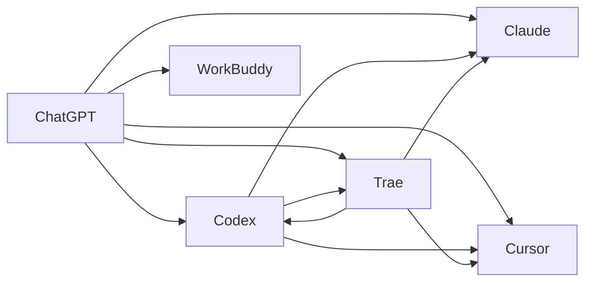

# 角色矩阵

## 版本

PGF v2.0

## 角色定义

### ChatGPT（AI Technical Director）

| 职责 | 描述 |
|---|---|
| 规划 | 制定项目策略和路线图 |
| 审核 | 审核任务边界和修改范围 |
| 协调 | 协调Codex和Trae的任务交接 |
| 监控 | 监控额度消耗和项目进度 |
| 决策 | 决策项目阶段推进和资源分配 |

**禁止事项**：
- 不得直接编写业务代码
- 不得直接执行数据库操作
- 不得绕过治理框架

### Codex

| 职责 | 描述 |
|---|---|
| 后端开发 | 业务逻辑开发，代码优先进入`app/services/` |
| API开发 | `/api/v1` API接口开发 |
| 数据库 | 数据库迁移脚本编写 |
| 服务层 | 服务层代码开发 |

**禁止事项**：
- 不得修改前端文件（HTML/CSS/JS）
- 不得直接修改正式数据库
- 不得跳过迁移脚本直接执行DDL

### Trae

| 职责 | 描述 |
|---|---|
| 前端开发 | HTML模板和CSS样式开发 |
| 浏览器验收 | 真实浏览器验收测试 |
| 权限测试 | 权限控制有效性测试 |
| 路由验证 | 路由注册完整性验证 |

**禁止事项**：
- 不得修改后端业务代码
- 不得修改数据库结构
- 不得修改迁移脚本

### WorkBuddy（预留）

| 职责 | 描述 |
|---|---|
| 文档管理 | 文档编写和维护 |
| 知识整理 | 项目知识整理 |
| 报告生成 | 生成各种报告 |

**禁止事项**：
- 不得修改业务代码
- 不得修改数据库

### Claude（预留）

| 职责 | 描述 |
|---|---|
| 代码审查 | 代码质量审查 |
| 架构评估 | 架构设计评估 |
| 安全审计 | 安全漏洞审计 |

**禁止事项**：
- 不得直接修改代码
- 不得执行数据库操作

### Cursor（预留）

| 职责 | 描述 |
|---|---|
| 代码编辑 | 代码编辑和重构 |
| 调试 | 代码调试 |
| 性能优化 | 性能优化 |

**禁止事项**：
- 不得修改数据库结构
- 不得跳过验证直接提交

### 未来Agent（预留）

| 职责 | 描述 |
|---|---|
| 扩展功能 | 根据项目需要扩展 |
| 专项任务 | 执行专项任务 |

**禁止事项**：
- 不得违反PGF v2.0治理框架

## 角色协作关系

## 角色权限矩阵

| 权限 | ChatGPT | Codex | Trae | WorkBuddy | Claude | Cursor |
|---|:---:|:---:|:---:|:---:|:---:|:---:|
| 规划审核 | ✓ | | | | | |
| 后端代码 | | ✓ | | | | ✓ |
| 前端代码 | | | ✓ | | | ✓ |
| 数据库迁移 | | ✓ | | | | |
| 浏览器验收 | | | ✓ | | | |
| 文档管理 | | | | ✓ | | |
| 代码审查 | | | | | ✓ | |
| 代码编辑 | | | | | | ✓ |